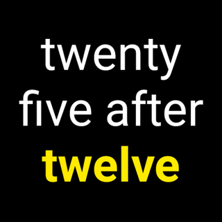

= Yet Another Fuzzy Text Face
Bartosz Małkowski <https://github.com/bmalkow[@bmalkow]>;
// settings:
:page-layout: base
:idprefix:
:idseparator: -
:source-language: java
:language: {source-language}
ifdef::env-github[:status:]

YAFT is watch face for Android Wear device.
It is inspired by https://github.com/wearewip/PebbleTextWatch[PebbleTextWatch].
Algorithms and translations are [line-through]#stolen# taken from https://github.com/hallettj/Fuzzy-Text-International[Fuzzy Text International] (thanks guys!).

== Features:

* fuzzy time in natural language
* date after tap
* notification when connection with phone is lost
* no configuration

++++

++++